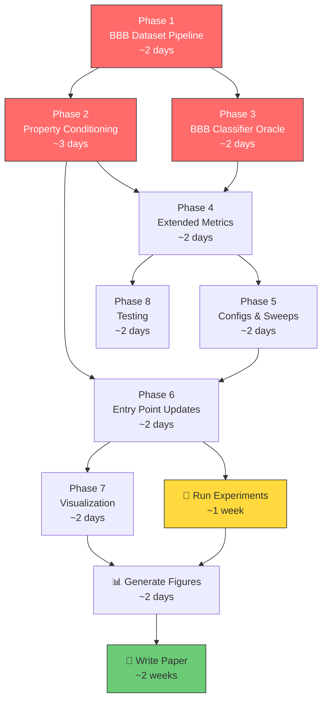

# Implementation Plan — FedDiff3D: Publication-Ready Research

> **Goal:** Transform the existing 3D-Molecule-Diffusion codebase into a publishable research paper on privacy-preserving 3D molecular generation for BBB permeability.

---

## Project File Map (After Implementation)

Files marked ★ are **new**, files marked ✎ are **modified**, unmarked files are untouched.

```
3D-Molecule-Diffusion/
├── configs/
│   ├── central.yaml                          # ✎ Add conditioning fields
│   ├── central_bbb.yaml                      # ★ BBB centralized training
│   ├── fed_iid.yaml                          # ✎ Add conditioning fields
│   ├── fed_niid.yaml                         # ✎ Add conditioning fields
│   ├── fed_bbb_iid.yaml                      # ★ BBB federated IID
│   ├── fed_bbb_niid.yaml                     # ★ BBB federated non-IID
│   └── sweeps/                               # ★ Experiment sweep configs
│       ├── sweep_K.yaml                      # ★ K ∈ {1,2,4,7} grid
│       ├── sweep_mu.yaml                     # ★ μ ∈ {0,0.01,0.1,1.0}
│       ├── sweep_lambda.yaml                 # ★ λ₂×λ₃ Pareto grid
│       └── ablation.yaml                     # ★ 7 ablation configurations
├── src/
│   ├── dataset.py                            # (untouched — QM9 loader)
│   ├── dataset_bbb.py                        # ★ BBBP/B3DB loader + SMILES→3D
│   ├── sampling.py                           # ✎ Add classifier-free guidance
│   ├── objectives.py                         # ✎ Add BBB reward term
│   ├── models/
│   │   ├── egnn.py                           # ✎ Add property conditioning input
│   │   ├── diffusion.py                      # (untouched)
│   │   └── bbb_classifier.py                 # ★ BBB oracle GNN classifier
│   ├── fed/
│   │   ├── partition.py                      # ✎ Add BBB-aware partitioning
│   │   ├── trainer.py                        # ✎ Pass conditioning to model
│   │   ├── server.py                         # ✎ BBB metric in quick eval
│   │   └── client.py                         # (untouched)
│   └── utils/
│       ├── evaluation.py                     # ✎ Add BBB%, scaffold diversity
│       ├── graph.py                          # (untouched)
│       └── visualization.py                  # ★ All plots and figures
├── scripts/                                  # ★ Experiment runner scripts
│   ├── run_sweep.py                          # ★ Grid-search experiment runner
│   ├── run_ablation.py                       # ★ Ablation study runner
│   ├── train_bbb_classifier.py              # ★ Train the BBB oracle
│   └── generate_paper_figures.py             # ★ All figures for the paper
├── train.py                                  # ✎ Support conditioning + BBB dataset
├── fed_train.py                              # ✎ Support conditioning + BBB dataset
├── generate_and_eval.py                      # ✎ BBB metrics + multi-dataset
├── tests/
│   ├── test_phase1_5.py                      # (untouched)
│   ├── test_fed_phase23.py                   # (untouched)
│   └── test_bbb_pipeline.py                  # ★ BBB pipeline tests
└── requirements.txt                          # ✎ Add deepchem, ogb
```

---

## Phase 1 — BBB Permeability Dataset Pipeline

> **Files:** ★ `src/dataset_bbb.py`, ✎ `requirements.txt`
> **Effort:** ~2 days

### 1.1 Data Sources

| Dataset | Size | Labels | Source |
|---|---|---|---|
| **BBBP (MoleculeNet)** | 2,039 compounds | Binary (BBB+ / BBB−) | `ogb` or `deepchem` download |
| **B3DB** | ~7,800 compounds | Binary + continuous logBB | CSV from [GitHub](https://github.com/theochem/B3DB) |

We use **BBBP as the primary dataset** (standard benchmark, directly comparable to other papers) and **B3DB as the extended dataset** (larger, for robustness claims).

### 1.2 New File: `src/dataset_bbb.py`

```python
# Key functions to implement:

def load_bbbp(root="data/bbbp", split="scaffold") -> tuple[Dataset, Dataset, Dataset]:
    """Load BBBP from MoleculeNet with scaffold split.
    
    Returns (train_dataset, val_dataset, test_dataset).
    Each item is a PyG Data object with:
        - data.pos:    (N, 3) float — 3D coordinates from RDKit embedding
        - data.z:      (N,)   long  — atomic numbers
        - data.y:      (1,)   long  — BBB permeability label (0 or 1)
        - data.smiles:  str          — original SMILES (for evaluation)
        - data.qed:    (1,)   float — QED score
        - data.logp:   (1,)   float — Crippen LogP
        - data.tpsa:   (1,)   float — topological polar surface area
        - data.mw:     (1,)   float — molecular weight
    """

def smiles_to_3d_data(smiles: str, bbb_label: int) -> Data | None:
    """Convert a SMILES string to a PyG Data object with 3D coords.
    
    Pipeline:
    1. Chem.MolFromSmiles(smiles)
    2. Chem.AddHs(mol)
    3. AllChem.EmbedMolecule(mol, AllChem.ETKDGv3())
    4. AllChem.MMFFOptimizeMolecule(mol)  # force-field relaxation
    5. Extract pos, z from mol.GetConformer()
    6. Compute properties: QED, LogP, tPSA, MW via RDKit Descriptors
    7. Return Data(pos=pos, z=z, y=label, qed=qed, logp=logp, ...)
    
    Returns None if embedding fails (some SMILES lack valid 3D conformers).
    """

def load_b3db(root="data/b3db") -> tuple[Dataset, Dataset, Dataset]:
    """Load B3DB with scaffold split. Same Data format as BBBP."""

# Property normalization constants (computed once from training set)
PROPERTY_STATS = {
    "qed":  {"mean": 0.5, "std": 0.2},
    "logp": {"mean": 2.0, "std": 1.5},
    "tpsa": {"mean": 60.0, "std": 30.0},
    "mw":   {"mean": 300.0, "std": 100.0},
}

def normalize_properties(data: Data) -> torch.Tensor:
    """Return a (4,) tensor of z-scored [QED, LogP, tPSA, MW]."""
```

### 1.3 SMILES → 3D Conversion Strategy

> [!IMPORTANT]
> ~5–10% of SMILES will fail 3D embedding. This is expected. Log failures and report the final dataset size.

```
SMILES string
    ↓ RDKit MolFromSmiles
RDKit Mol (2D)
    ↓ AddHs + EmbedMolecule(ETKDGv3)
RDKit Mol (3D with hydrogens)
    ↓ MMFFOptimizeMolecule (force field)
Optimized 3D conformer
    ↓ GetConformer().GetPositions()
pos: (N, 3) numpy array
    ↓ GetAtomicNum() per atom
z: (N,) numpy array
    ↓ Descriptors.qed(), MolLogP(), ...
properties: (4,) tensor
    ↓ Package into PyG Data
Data(pos, z, y, qed, logp, tpsa, mw, smiles)
```

### 1.4 Modifications to `requirements.txt`

```diff
 torch>=2.0.0
 torch-geometric
 e3nn
 rdkit
 matplotlib
 tqdm
 pandas
 scikit-learn
 flwr
 pyyaml
+deepchem
+ogb
+seaborn
```

### 1.5 Verification

- [ ] `load_bbbp()` returns train/val/test splits with correct sizes
- [ ] Every `Data` object has `.pos`, `.z`, `.y`, `.qed`, `.logp` attributes
- [ ] `pos` has realistic bond lengths (C–C ≈ 1.5 Å, C–H ≈ 1.1 Å)
- [ ] BBB label distribution: approximately 75% BBB+ / 25% BBB− in BBBP

---

## Phase 2 — Property-Conditioned EGNN + Classifier-Free Guidance

> **Files:** ✎ `src/models/egnn.py`, ✎ `src/sampling.py`, ✎ `src/fed/trainer.py`
> **Effort:** ~3 days

### 2.1 Modify `EquivariantGenerator` in [egnn.py](file:///c:/Users/prave/OneDrive/Desktop/BioInformatics/3D-Molecule-Diffusion/src/models/egnn.py)

**Goal:** Accept an optional property conditioning vector `cond` alongside timestep `t`.

#### Changes to `__init__`:

```diff
 def __init__(
     self,
     num_types: int = 10,
     node_dim: int = 64,
     edge_dim: int = 64,
     num_layers: int = 4,
     time_dim: int = 32,
+    cond_dim: int = 0,       # 0 = unconditional (backward compatible)
+    num_cond_classes: int = 2, # for class-conditional: BBB+ / BBB-
 ) -> None:
     super().__init__()
+    self.cond_dim = cond_dim
+    # Property conditioning projector
+    if cond_dim > 0:
+        # Input: [class_embedding(num_cond_classes) + continuous_props(4)]
+        self.cond_embed = nn.Embedding(num_cond_classes, cond_dim // 2)
+        self.cond_proj = nn.Sequential(
+            nn.Linear(cond_dim // 2 + 4, cond_dim),  # 4 = QED, LogP, tPSA, MW
+            nn.SiLU(),
+            nn.Linear(cond_dim, time_dim),            # project to time_dim
+        )
```

#### Changes to `forward` and `encode`:

```diff
 def forward(
     self,
     z: torch.Tensor,
     pos: torch.Tensor,
     edge_index: torch.Tensor,
     t: torch.Tensor,
     batch: torch.Tensor | None = None,
+    cond: dict[str, torch.Tensor] | None = None,
 ) -> tuple[torch.Tensor, torch.Tensor, torch.Tensor]:
```

**Conditioning injection:** The conditioning vector is **added to the timestep embedding** before it enters the EGNN layers. This is the standard approach (used in EDM, Imagen, etc.):

```python
t_emb = self.time_proj(timestep_embedding(t, self.time_dim))  # (B, time_dim)

if self.cond_dim > 0 and cond is not None:
    class_emb = self.cond_embed(cond["label"])          # (B, cond_dim//2)
    props = cond["properties"]                           # (B, 4)
    cond_emb = self.cond_proj(torch.cat([class_emb, props], dim=-1))  # (B, time_dim)
    t_emb = t_emb + cond_emb  # additive conditioning

t_emb_per_atom = t_emb[batch]  # broadcast to atoms
```

### 2.2 Classifier-Free Guidance in [sampling.py](file:///c:/Users/prave/OneDrive/Desktop/BioInformatics/3D-Molecule-Diffusion/src/sampling.py)

**Goal:** At inference, generate molecules steered toward BBB+ using guidance scale `w`.

#### New function signature:

```diff
 def sample_molecules(
     model,
     coord_ddpm: CenteredDDPM,
     type_ddpm: TypeDDPM,
     atom_counts: torch.Tensor,
     device: str | torch.device = "cuda",
     ddim_steps: int | None = None,
     eta: float = 0.0,
     x0_clamp: float = 10.0,
+    cond: dict[str, torch.Tensor] | None = None,
+    guidance_scale: float = 0.0,
 ) -> tuple[torch.Tensor, torch.Tensor]:
```

#### Guidance logic inside the reverse loop:

```python
# Classifier-free guidance (Ho & Salimans, 2022):
# ε_guided = ε_unconditional + w * (ε_conditional - ε_unconditional)

if guidance_scale > 0.0 and cond is not None:
    # Conditional forward pass
    noise_cond, type_logits_cond, _ = model(z, pos, edge_index, t, batch, cond=cond)
    # Unconditional forward pass (cond=None triggers unconditional mode)
    noise_uncond, type_logits_uncond, _ = model(z, pos, edge_index, t, batch, cond=None)
    # Guided prediction
    noise_pred = noise_uncond + guidance_scale * (noise_cond - noise_uncond)
    type_logits = type_logits_uncond + guidance_scale * (type_logits_cond - type_logits_uncond)
else:
    noise_pred, type_logits, _ = model(z, pos, edge_index, t, batch, cond=cond)
```

### 2.3 Training with Label Dropout (in [trainer.py](file:///c:/Users/prave/OneDrive/Desktop/BioInformatics/3D-Molecule-Diffusion/src/fed/trainer.py))

For classifier-free guidance to work, the model must be trained with **random label dropout** — 10% of the time, the conditioning is set to `None`:

```python
# Inside _batch_loss():
if self.cfg.get("conditioning", {}).get("enabled", False):
    dropout_prob = self.cfg["conditioning"].get("label_dropout", 0.1)
    cond = self._extract_cond(batch_data)
    # Randomly drop conditioning for classifier-free guidance training
    if self.model.training and torch.rand(1).item() < dropout_prob:
        cond = None
else:
    cond = None

noise_pred, type_logits, node_h = self.model(
    noisy_types, noisy_pos, edge_index, t, batch_data.batch, cond=cond,
)
```

### 2.4 Backward Compatibility

> [!IMPORTANT]
> When `cond_dim=0` (default), the model behaves identically to the current unconditional version. All existing QM9 configs work unchanged. Only BBB configs set `cond_dim > 0`.

### 2.5 Verification

- [ ] Unconditional mode (`cond_dim=0`): output identical to current model (regression test)
- [ ] Conditional mode (`cond_dim=32`): forward pass runs without error
- [ ] Label dropout: with `dropout_prob=1.0`, output matches unconditional mode
- [ ] Guidance: with `guidance_scale=0.0`, output matches standard conditional

---

## Phase 3 — BBB Permeability Classifier (Oracle)

> **Files:** ★ `src/models/bbb_classifier.py`, ★ `scripts/train_bbb_classifier.py`
> **Effort:** ~2 days

### 3.1 New File: `src/models/bbb_classifier.py`

A lightweight GNN classifier trained on BBBP to score generated molecules:

```python
class BBBClassifier(nn.Module):
    """3-layer GCN classifier for BBB permeability prediction.
    
    Architecture:
        atom_embedding(z) → GCN_1 → GCN_2 → GCN_3 → global_mean_pool → MLP → sigmoid
    
    Input: PyG Data with pos, z, edge_index
    Output: probability of BBB permeability (0–1)
    """
    
    def __init__(self, num_types=10, hidden_dim=128, num_layers=3):
        ...
    
    def forward(self, z, edge_index, batch) -> torch.Tensor:
        """Returns BBB+ probability per molecule."""
        ...
    
    @torch.no_grad()
    def predict_mol(self, mol: Chem.Mol) -> float:
        """Score a single RDKit Mol. Returns BBB+ probability."""
        # Convert mol → Data → forward pass
        ...
    
    @torch.no_grad()
    def predict_batch(self, mols: list[Chem.Mol]) -> list[float]:
        """Score a batch of RDKit Mols."""
        ...
```

### 3.2 Training Script: `scripts/train_bbb_classifier.py`

```python
"""Train a BBB permeability classifier on BBBP dataset.

Usage: python scripts/train_bbb_classifier.py --epochs 100 --output models/bbb_oracle.pt

Training protocol:
    - Scaffold split (train 80% / val 10% / test 10%)
    - Binary cross-entropy loss
    - Adam optimizer, lr=1e-3
    - Early stopping on validation AUROC
    - Report: AUROC, accuracy, precision, recall, F1

Target: AUROC ≥ 0.90 on test set (literature baseline is ~0.92).
"""
```

### 3.3 Verification

- [ ] Classifier achieves AUROC ≥ 0.88 on BBBP test set (scaffold split)
- [ ] `predict_mol()` returns a float in [0, 1] for any valid RDKit Mol
- [ ] `predict_batch()` handles `None` entries gracefully (returns 0.0)

---

## Phase 4 — Extended Evaluation Metrics

> **Files:** ✎ `src/utils/evaluation.py`, ✎ `generate_and_eval.py`
> **Effort:** ~2 days

### 4.1 New Metrics in [evaluation.py](file:///c:/Users/prave/OneDrive/Desktop/BioInformatics/3D-Molecule-Diffusion/src/utils/evaluation.py)

Add these functions alongside the existing 7 MOSES metrics:

```python
def bbb_permeability_rate(
    mols: Sequence[Chem.Mol | None],
    classifier: BBBClassifier,
) -> float:
    """Fraction of valid generated molecules predicted as BBB-permeable (p > 0.5)."""

def scaffold_diversity(mols: Sequence[Chem.Mol | None]) -> float:
    """Number of unique Bemis-Murcko scaffolds / number of valid molecules."""

def scaffold_coverage(
    mols: Sequence[Chem.Mol | None],
    train_mols: Sequence[Chem.Mol],
) -> float:
    """Fraction of training-set scaffolds reproduced in generated molecules."""

def lipinski_pass_rate(mols: Sequence[Chem.Mol | None]) -> float:
    """Fraction of valid molecules passing Lipinski's Rule of Five."""

def veber_pass_rate(mols: Sequence[Chem.Mol | None]) -> float:
    """Fraction passing Veber rules (tPSA ≤ 140, rotatable bonds ≤ 10)."""

def cns_mpo_score(mols: Sequence[Chem.Mol | None]) -> float:
    """Average CNS Multi-Parameter Optimization score (Wager et al., 2010).
    
    6-parameter score: MW, LogP, HBD, tPSA, pKa, CLogD.
    Score 0-6; higher = more BBB-favorable. Mean ≥ 4.0 is good.
    """
```

### 4.2 Updated `evaluate()` Function

```diff
 def evaluate(
     mols: Sequence[Chem.Mol | None],
     train_smiles: set[str],
     train_mols: Sequence[Chem.Mol],
+    bbb_classifier: BBBClassifier | None = None,
 ) -> dict[str, float]:
     return {
         # Existing MOSES metrics
         "Validity": validity(mols) * 100.0,
         "Uniqueness": uniqueness(mols) * 100.0,
         "Novelty": novelty(mols, train_smiles) * 100.0,
         "IntDiv_p": internal_diversity(mols),
         "QED": mean_qed(mols),
         "LogP": mean_logp(mols),
         "SNN": snn(mols, train_mols),
+        # New BBB-specific metrics
+        "BBB%": bbb_permeability_rate(mols, bbb_classifier) if bbb_classifier else -1,
+        "ScaffDiv": scaffold_diversity(mols),
+        "ScaffCov": scaffold_coverage(mols, train_mols),
+        "Lipinski%": lipinski_pass_rate(mols) * 100.0,
+        "CNS_MPO": cns_mpo_score(mols),
     }
```

### 4.3 Verification

- [ ] All new metrics return floats in sensible ranges
- [ ] `evaluate()` backward compatible when `bbb_classifier=None`
- [ ] Scaffold diversity: QM9 molecules should show IntDiv > 0.8

---

## Phase 5 — Configuration & Experiment Infrastructure

> **Files:** ★ `configs/central_bbb.yaml`, ★ `configs/fed_bbb_*.yaml`, ✎ `configs/central.yaml`, ★ `configs/sweeps/*.yaml`, ★ `scripts/run_sweep.py`, ★ `scripts/run_ablation.py`
> **Effort:** ~2 days

### 5.1 New Config: `configs/central_bbb.yaml`

```yaml
seed: 42

data:
  dataset: bbbp          # "qm9" | "bbbp" | "b3db"
  root: data/bbbp
  train_frac: 0.8
  val_frac: 0.1

model:
  num_types: 10
  node_dim: 128          # larger for BBB molecules (bigger than QM9)
  edge_dim: 128
  num_layers: 6          # deeper for more complex molecules
  time_dim: 32
  cond_dim: 32           # ← NEW: enables property conditioning
  num_cond_classes: 2    # BBB+ / BBB-

conditioning:
  enabled: true
  label_dropout: 0.1     # 10% unconditional for classifier-free guidance
  guidance_scale: 2.0    # used at inference time

diffusion:
  num_steps: 1000
  beta_start: 1.0e-4
  beta_end: 0.02

training:
  epochs: 200
  batch_size: 64
  lr: 5.0e-4
  weight_decay: 1.0e-5
  kNN: 6                 # more neighbors for larger molecules
  type_loss_weight: 0.5
  valence_loss_weight: 0.1
  diversity_loss_weight: 0.01
  patience: 20

bbb_classifier:
  checkpoint: models/bbb_oracle.pt   # trained in Phase 3

checkpoint:
  dir: checkpoints/bbb
  save_every: 10
```

### 5.2 Modify Existing Configs

Add to [central.yaml](file:///c:/Users/prave/OneDrive/Desktop/BioInformatics/3D-Molecule-Diffusion/configs/central.yaml), [fed_iid.yaml](file:///c:/Users/prave/OneDrive/Desktop/BioInformatics/3D-Molecule-Diffusion/configs/fed_iid.yaml), [fed_niid.yaml](file:///c:/Users/prave/OneDrive/Desktop/BioInformatics/3D-Molecule-Diffusion/configs/fed_niid.yaml):

```diff
+data:
+  dataset: qm9          # ← explicit dataset selector (default for backward compat)

 model:
   num_types: 10
   node_dim: 64
+  cond_dim: 0            # 0 = unconditional (backward compatible)

+conditioning:
+  enabled: false
```

### 5.3 Experiment Sweep Script: `scripts/run_sweep.py`

```python
"""Run a grid of experiments with multiple seeds.

Usage:
    python scripts/run_sweep.py --sweep configs/sweeps/sweep_K.yaml --seeds 42,123,456

Sweep YAML format:
    base_config: configs/fed_bbb_niid.yaml
    grid:
      fed.num_clients: [1, 2, 4, 7]
      fed.mode: [iid, niid]
    seeds: [42, 123, 456]

For each combination:
    1. Create a temporary config by overriding base_config fields
    2. Run fed_train.py
    3. Run generate_and_eval.py with 1000 samples
    4. Save results to outputs/sweep_<name>/<combo>/seed_<s>/results.json
"""
```

### 5.4 Ablation Configurations: `configs/sweeps/ablation.yaml`

```yaml
base_config: configs/central_bbb.yaml
ablations:
  full_model:             {}                                    # no changes (baseline)
  no_conditioning:        { conditioning.enabled: false, model.cond_dim: 0 }
  no_fedprox:             { fed.proximal_mu: 0.0 }
  no_personal_heads:      { fed.personal_heads: false }
  no_valence_penalty:     { training.valence_loss_weight: 0.0 }
  no_diversity_loss:      { training.diversity_loss_weight: 0.0 }
  no_multi_obj:           { training.valence_loss_weight: 0.0, training.diversity_loss_weight: 0.0 }
  fewer_layers:           { model.num_layers: 2 }
  no_3d:                  { model.flatten_to_2d: true }         # special flag: zero out pos
```

### 5.5 Verification

- [ ] All new configs pass YAML validation
- [ ] `run_sweep.py --dry-run` prints the full grid without executing
- [ ] Backward compatibility: `python train.py --config configs/central.yaml` runs unchanged

---

## Phase 6 — Modify Training & Generation Entry Points

> **Files:** ✎ `train.py`, ✎ `fed_train.py`, ✎ `generate_and_eval.py`
> **Effort:** ~2 days

### 6.1 Modify [train.py](file:///c:/Users/prave/OneDrive/Desktop/BioInformatics/3D-Molecule-Diffusion/train.py)

```diff
 from src.dataset import load_qm9
+from src.dataset_bbb import load_bbbp, load_b3db

 def train_diffusion(config_path: str = "configs/central.yaml") -> None:
     ...
-    full_dataset = load_qm9(root=data_cfg["root"])
+    dataset_name = data_cfg.get("dataset", "qm9")
+    if dataset_name == "qm9":
+        full_dataset = load_qm9(root=data_cfg["root"])
+    elif dataset_name == "bbbp":
+        train_ds, val_ds, test_ds = load_bbbp(root=data_cfg["root"])
+    elif dataset_name == "b3db":
+        train_ds, val_ds, test_ds = load_b3db(root=data_cfg["root"])
     ...
     # Build conditioning dict from batch
+    cond = None
+    if cfg.get("conditioning", {}).get("enabled", False):
+        cond = {
+            "label": batch_data.y.to(device),
+            "properties": torch.stack([
+                batch_data.qed, batch_data.logp,
+                batch_data.tpsa, batch_data.mw
+            ], dim=-1).to(device),
+        }
+        # Label dropout for classifier-free guidance
+        if random.random() < cfg["conditioning"].get("label_dropout", 0.1):
+            cond = None
```

### 6.2 Modify [fed_train.py](file:///c:/Users/prave/OneDrive/Desktop/BioInformatics/3D-Molecule-Diffusion/fed_train.py)

Same dataset dispatch logic. Additionally modify [partition.py](file:///c:/Users/prave/OneDrive/Desktop/BioInformatics/3D-Molecule-Diffusion/src/fed/partition.py) to support BBB-based partitioning:

```python
def partition_bbb_label(
    dataset, num_clients: int, seed: int = 42
) -> dict[int, list[int]]:
    """Non-IID partitioning by BBB label.
    
    Some clients get mostly BBB+ molecules, others mostly BBB-.
    This simulates real pharmaceutical data silos where different 
    companies have different chemical libraries.
    """
```

### 6.3 Modify [generate_and_eval.py](file:///c:/Users/prave/OneDrive/Desktop/BioInformatics/3D-Molecule-Diffusion/generate_and_eval.py)

```diff
+parser.add_argument("--guidance_scale", type=float, default=2.0)
+parser.add_argument("--target_bbb", type=int, default=1, help="0=BBB-, 1=BBB+")
+parser.add_argument("--bbb_oracle", type=str, default=None, help="Path to BBB classifier")

 # During sampling:
+cond = None
+if args.target_bbb is not None and ckpt_cfg.get("conditioning", {}).get("enabled"):
+    cond = build_target_cond(args.target_bbb, num_graphs=n_batch, device=device)

 pos, z = sample_molecules(
     model, coord_ddpm, type_ddpm,
     atom_counts, device=device,
     ddim_steps=args.ddim_steps, eta=args.eta,
+    cond=cond, guidance_scale=args.guidance_scale,
 )
```

### 6.4 Verification

- [ ] `python train.py --config configs/central.yaml` works unchanged (QM9)
- [ ] `python train.py --config configs/central_bbb.yaml` trains on BBBP
- [ ] `python generate_and_eval.py --target_bbb 1 --guidance_scale 2.0` generates BBB+ molecules
- [ ] BBB% in generated output is significantly > 50% (random baseline)

---

## Phase 7 — Visualization Pipeline

> **Files:** ★ `src/utils/visualization.py`, ★ `scripts/generate_paper_figures.py`
> **Effort:** ~2 days

### 7.1 New File: `src/utils/visualization.py`

```python
def plot_convergence_curves(history_paths: dict[str, str], output_path: str):
    """Plot server loss vs round for multiple configs (Fig. 1 in paper).
    
    Args:
        history_paths: {"IID K=4": "outputs/fed_iid/history.json", ...}
    """

def plot_metric_comparison_table(results: dict[str, dict], output_path: str):
    """Render a LaTeX-ready comparison table (Table I in paper)."""

def plot_pareto_front(sweep_results: list[dict], output_path: str):
    """Validity vs Uniqueness Pareto front over λ₂×λ₃ grid (Fig. 2)."""

def plot_mode_collapse_analysis(history_paths: dict, output_path: str):
    """IntDiv and scaffold diversity vs round number (Fig. 3)."""

def plot_ablation_bars(ablation_results: dict, output_path: str):
    """Grouped bar chart of ablation study results (Fig. 4)."""

def plot_bbb_property_distribution(mols: list, output_path: str):
    """Violin plots of QED, LogP, tPSA, MW for generated BBB+ vs BBB- (Fig. 5)."""

def render_molecules_3d(mols: list, output_path: str):
    """Render 3D ball-and-stick structures of representative molecules (Fig. 6)."""

def plot_guidance_scale_sweep(results: dict, output_path: str):
    """BBB% vs guidance scale w (Fig. 7 — shows controllability)."""
```

### 7.2 Verification

- [ ] All plots render without error with synthetic data
- [ ] Figures saved as both PDF (for paper) and PNG (for slides)
- [ ] Color scheme is colorblind-friendly (using seaborn's "colorblind" palette)

---

## Phase 8 — Testing & Paper Preparation

> **Files:** ★ `tests/test_bbb_pipeline.py`
> **Effort:** ~2 days

### 8.1 New Test File: `tests/test_bbb_pipeline.py`

```python
class TestBBBDataset:
    def test_smiles_to_3d_valid(self):
        """Aspirin SMILES converts to valid 3D Data."""
    
    def test_smiles_to_3d_properties(self):
        """Data object has qed, logp, tpsa, mw attributes."""
    
    def test_bbbp_label_distribution(self):
        """BBBP dataset has ~75% BBB+ labels."""

class TestConditionedEGNN:
    def test_unconditional_backward_compat(self):
        """cond_dim=0 produces identical output to original model."""
    
    def test_conditional_forward(self):
        """cond_dim=32 forward pass runs without error."""
    
    def test_label_dropout(self):
        """100% dropout produces unconditional output."""
    
    def test_guidance_scale_zero(self):
        """guidance_scale=0 matches standard conditional output."""

class TestBBBClassifier:
    def test_predict_mol_range(self):
        """Output is in [0, 1] for any valid Mol."""
    
    def test_known_bbb_positive(self):
        """Caffeine (known BBB+) scores > 0.5."""

class TestExtendedMetrics:
    def test_scaffold_diversity_range(self):
        """ScaffDiv in [0, 1]."""
    
    def test_lipinski_known(self):
        """Aspirin passes Lipinski (known drug-like)."""
```

---

## Execution Order & Dependencies



---

## Open Questions

> [!IMPORTANT]
> These decisions affect the implementation. Please review:

1. **Dataset priority:** Should we use **BBBP only** (2,039 molecules — standard benchmark, faster experiments) or **BBBP + B3DB** (both — stronger paper but ~2x implementation effort)?

2. **Model size for BBB:** BBB molecules are larger than QM9 (avg ~25 atoms vs ~18). Should we scale up `node_dim` from 64→128 and `num_layers` from 4→6, or keep the same architecture for a cleaner ablation?

3. **Guidance scale:** Do you want to include a guidance scale sweep (w ∈ {0, 0.5, 1.0, 2.0, 4.0, 8.0}) as a figure? This shows controllability but adds ~6 experiment runs.

4. **Number of seeds:** 3 seeds (minimum for error bars) or 5 seeds (stronger statistics but 5x compute)?

5. **Compute resources:** What GPU do you have access to? This affects experiment batch sizes and total sweep time. For reference, QM9 training takes ~2 hours on an RTX 3090 for 100 epochs.

---

## Verification Plan

### Automated Tests
```bash
# Run all tests
python -m pytest tests/ -v

# Run only BBB pipeline tests
python -m pytest tests/test_bbb_pipeline.py -v
```

### Manual Verification
1. After Phase 1: Inspect 5 random BBBP molecules — verify 3D coords look reasonable
2. After Phase 3: BBB oracle AUROC ≥ 0.88 on test set
3. After Phase 6: Run 1-epoch smoke test on BBBP with conditioning
4. After full experiments: BBB% of conditioned generation ≫ 50% (random baseline)
5. Final: All paper figures render correctly, tables are consistent
